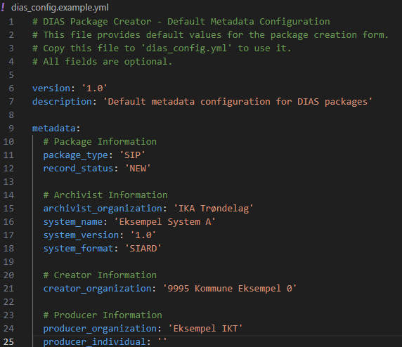
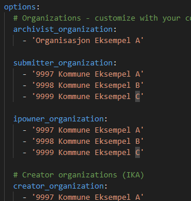
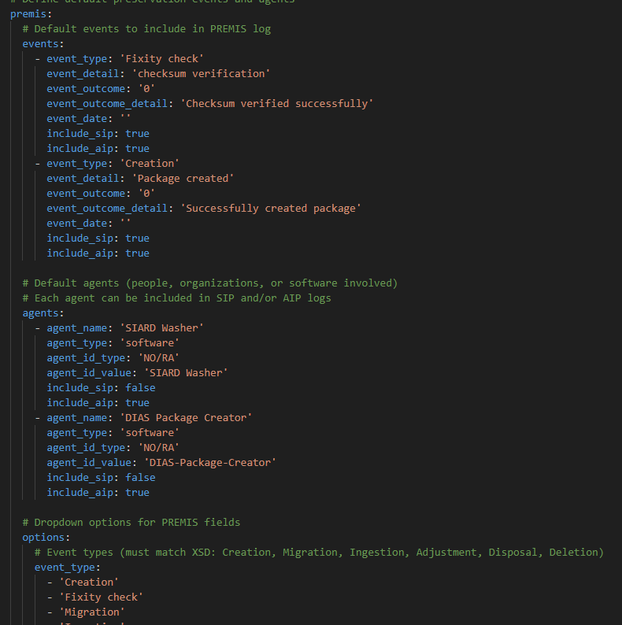

# DIAS Package Creator - Konfigurasjonsfilstøtte

## Oversikt
Applikasjonen laste inn organisasjonspesifikke valg for skjemautfylling av METS-data fra en YAML-konfigurasjonsfil. Dette gjør det enkelt å velge og standarisere bruken av disse verdier.

## Funksjoner
- **Valgfri**: Hvis ingen konfigurasjonsfil finnes, faller applikasjonen automatisk tilbake til eksempelkonfigurasjonen
- **Auto-lasting**: Konfigurasjonen lastes automatisk ved oppstart
- **Alternativ plan**: Hvis `dias_config.yml` ikke eksisterer, brukes `dias_config.example.yml`
- **Enkel å redigere**: YAML-formatet er valgt, da dette er strukturert og lettlest også for mennesker 
- **Egendefinerte rullegardinmenyer**: Definer egne valg for organisasjoner, systemer osv.

## Steder for konfigurasjonsfil
Applikasjonen søker etter konfigurasjonsfiler på følgende steder (i rekkefølge):

1. Nåværende arbeidsmappe:
   - `dias_config.yml`
   - `dias_config.yaml`
   - `.dias_config.yml`
   - `.dias_config.yaml`

2. Brukerens hjemmekatalog (samme filnavn)

3. Applikasjonskatalogen (samme filnavn)

4. **Hvis ingen finnes**: Faller tilbake til `dias_config.example.yml` i applikasjonskatalogen

## Bruk

### Lage en konfigurasjonsfil

1. **Manuell opprettelse**:
   - Kopier `dias_config.example.yml` til `dias_config.yml`
   - Rediger verdiene etter behov

### Eksempel på konfigurasjonsfil
Konfigurasjonsfilen har 3 seksjoner.

**Første seksjon** Inneholder forhåndsvalg av METS-data, som gjerne inneholder felter som er felles for alle pakker.



**Andre seksjoner** Inneholder organisasjonens egne valg for rullegardinmenyer. Her kan det fylles ut kommunenummer, navn, og ulike systemer som brukes av kommunene. Elementene er forklart lenger nede i dette dokumentet.



**Tredje seksjon** Inneholder støtte for å legge inn Premis-data. Dette er metadata som en kan ønske å tilgjengeliggjøre i en pakkeoversikt basert på Premis.




## Tilgjengelige konfigurasjonsfelt

### Metadata-felt
Alle felt i metadata-skjemaet kan konfigureres med standardverdier:

- `package_type` - Type pakke (SIP, AIP, osv.)
- `label` - Pakkebeskrivelse/tittel
- `record_status` - Record-status (NEW, SUPPLEMENT, osv.)
- `archivist_organization` - Navn på arkivarorganisasjon
- `system_name` - Navn på system/programvare
- `system_version` - Systemversjon
- `system_format` - Innholdsformat (f.eks. SIARD)
- `creator_organization` - Opphavende organisasjon (Kommune))
- `producer_organization` - Produsentorganisasjon (IKT avdeling)
- `producer_individual` - Navn på produsentperson
- `producer_software` - Produsentprogramvare
- `submitter_organization` - Innsenderorganisasjon
- `submitter_individual` - Innsender
- `ipowner_organization` - IP-eierorganisasjon
- `preservation_organization` - Bevaringsorganisasjon
- `submission_agreement` - Avtale-ID for innsending
- `start_date` - Innholdets startdato (ÅÅÅÅ-MM-DD)
- `end_date` - Innholdets sluttdato (ÅÅÅÅ-MM-DD)

### Rullegardinvalg
Du kan tilpasse rullegardinlistene for følgende felt:

- `archivist_organization` - Liste over arkivorganisasjoner
- `submitter_organization` - Liste over innsendeorganisasjoner
- `ipowner_organization` - Liste over IP-eier-organisasjoner
- `creator_organization` - Liste over opphavende (IKA) organisasjoner
- `producer_organization` - Liste over produsentorganisasjoner
- `system_name` - Liste over system-/programvarenavn
- `system_version` - Liste over systemversjoner
- `system_format` - Liste over innholdsformater
- `producer_software` - Liste over produsentprogramvare
- `preservation_organization` - Liste over bevaringsorganisasjoner

**Merk**: Valgene som defineres i konfigurasjonsfilen vil erstatte applikasjonens standardvalg.

## Installasjon

Hvis ikke det benyttes en ferdig kompilert versjon av pakkeren, krever konfigurasjonsfunksjonaliteten PyYAML:

```bash
pip install -r requirements.txt
```

Eller manuelt:

```bash
pip install PyYAML
```

Hvis PyYAML ikke er installert, vil applikasjonen fortsatt fungere, men konfigurasjonsfiler vil bli ignorert stille.

## Oppførsel

- Når applikasjonen starter, sjekker den etter en konfigurasjonsfil
- Hvis en gyldig fil finnes, forhåndsutfylles skjemaet med standardverdiene
- Bruker kan fortsatt endre alle felt — standardene er kun startverdier
- Klikk på «Reset» vil laste standardene på nytt fra konfigurasjonsfilen
- Ugyldige eller manglende konfigurasjonsfiler gir ikke feil

## Tips

1. Bruk organisasjonsomfattende konfigurasjonsfiler lagret på et nettverkssted
2. Hver bruker kan overstyre med sin egen lokale konfigurasjon
3. La felt stå tomme (`''`) i konfigurasjonen hvis du ikke ønsker standardverdi
4. Kommentarer i YAML starter med `#`
