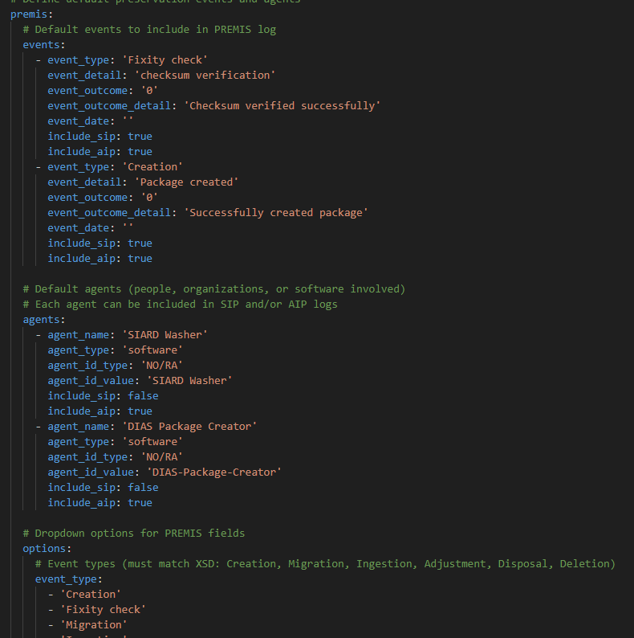
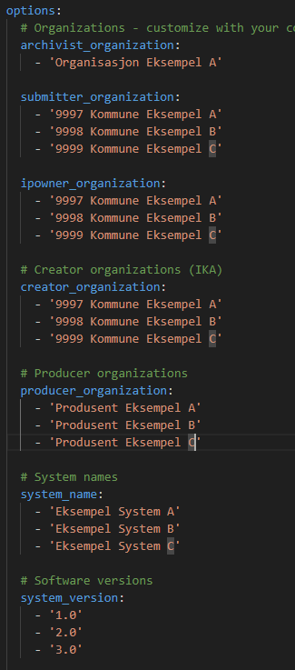
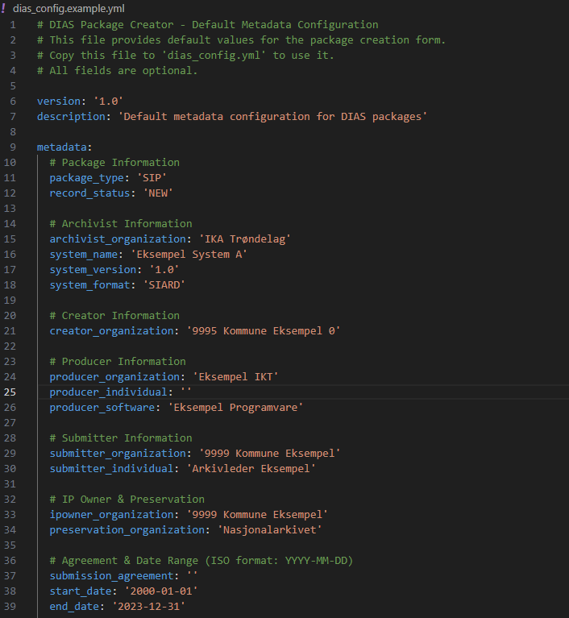
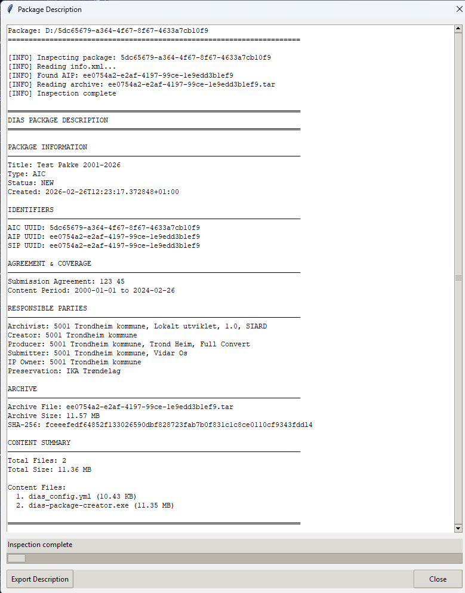

# Brukerveiledning (USER_GUIDE.md)

Dette dokumentet gir en trinnvis veiledning for bruk av DIAS Package Creator, inkludert skjermbilder og vanlige feilsituasjoner.

## 1. Hovedvindu og Faner
Applikasjonen består av tre hovedfaner:
1. **Opprett Pakke:** For å generere nye DIAS-pakker fra input-data.
2. **Validering:** For å validere eksisterende pakker mot DIAS-standarden.
3. **Innstillinger:** For å konfigurere applikasjonen (f.eks. output-mappe, loggnivå).



## 2. Trinnvise Instruksjoner

### 2.1. Opprett en ny pakke
1. Gå til fanen **Opprett Pakke**.
2. Velg input-mappen som inneholder datafilene og metadataene.
3. Velg output-mappen der den genererte pakken skal lagres.
4. Fyll inn nødvendige metadata (f.eks. pakkenavn, beskrivelse).
5. Klikk på **Generer Pakke**.
6. Vent til prosessen er fullført. En kvittering vil vises på skjermen.



### 2.2. Valider en eksisterende pakke
1. Gå til fanen **Validering**.
2. Velg pakken (ZIP-filen eller mappen) som skal valideres.
3. Klikk på **Valider Pakke**.
4. Resultatet av valideringen vil vises i vinduet. Eventuelle feil eller advarsler vil bli listet opp.



### 2.3. Konfigurer innstillinger
1. Gå til fanen **Innstillinger**.
2. Juster standard output-mappe, loggnivå og andre preferanser.
3. Klikk på **Lagre Innstillinger**.



## 3. Vanlige Feilsituasjoner og Løsninger
- **Feil: "Ugyldig input-mappe"**
  - *Årsak:* Den valgte mappen finnes ikke eller mangler nødvendige filer.
  - *Løsning:* Kontroller at mappen eksisterer og inneholder riktig dataformat.
- **Feil: "Validering feilet: Manglende metadata"**
  - *Årsak:* Pakken mangler påkrevde metadata-felt i henhold til DIAS-standarden.
  - *Løsning:* Sjekk valideringsrapporten for detaljer om hvilke felt som mangler, og oppdater input-dataene.
- **Feil: "Kunne ikke skrive til output-mappe"**
  - *Årsak:* Manglende skriverettigheter til den valgte mappen.
  - *Løsning:* Velg en annen mappe eller kontakt systemadministrator for å få riktige rettigheter.

## 4. Kvitteringseksempler for Saksbehandlingssystemer
Når en pakke er generert og validert, kan applikasjonen produsere en kvittering (f.eks. i XML- eller JSON-format) som kan importeres i et saksbehandlingssystem.

**Eksempel på JSON-kvittering:**
```json
{
  "package_id": "pkg-12345",
  "status": "SUCCESS",
  "timestamp": "2026-02-27T10:00:00Z",
  "checksum": "a1b2c3d4e5f6...",
  "validation_warnings": []
}
```

**Eksempel på XML-kvittering:**
```xml
<Receipt>
  <PackageId>pkg-12345</PackageId>
  <Status>SUCCESS</Status>
  <Timestamp>2026-02-27T10:00:00Z</Timestamp>
  <Checksum>a1b2c3d4e5f6...</Checksum>
</Receipt>
```
*(Disse formatene bør standardiseres i henhold til organisasjonens krav)*

## 5. FAQ (Ofte Stilte Spørsmål)
- **Spørsmål:** Hvor finner jeg loggfilene?
  - *Svar:* Loggfilene lagres som standard i `logs/`-mappen der applikasjonen er installert.
- **Spørsmål:** Hvordan oppdaterer jeg applikasjonen?
  - *Svar:* Se `INSTALL.md` for instruksjoner om oppgradering.
