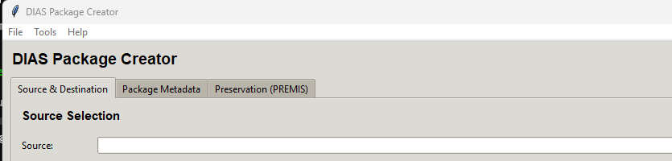
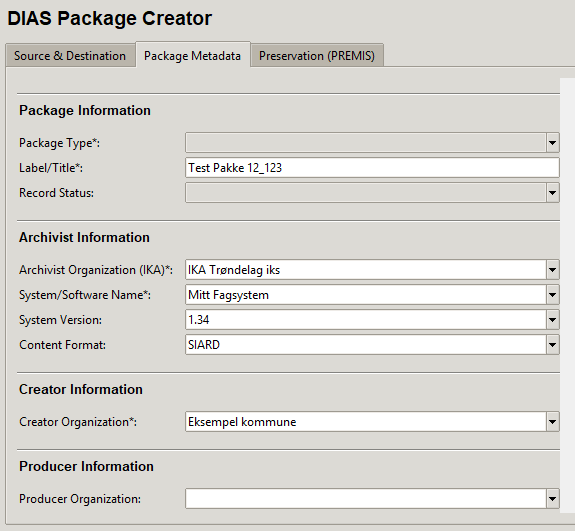
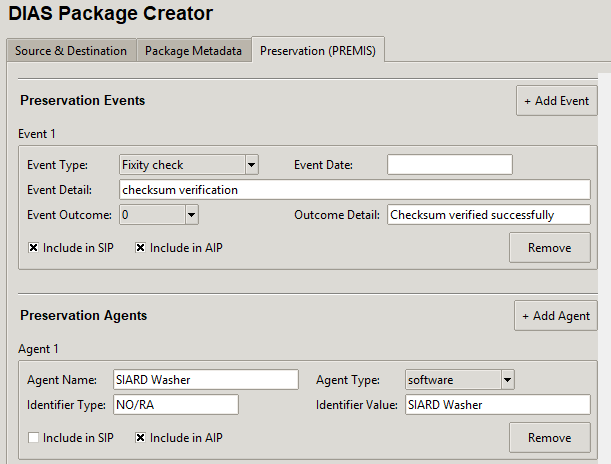
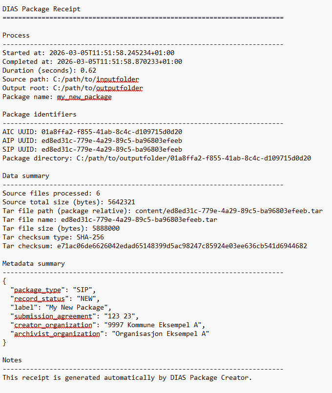
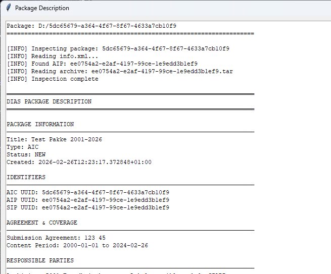
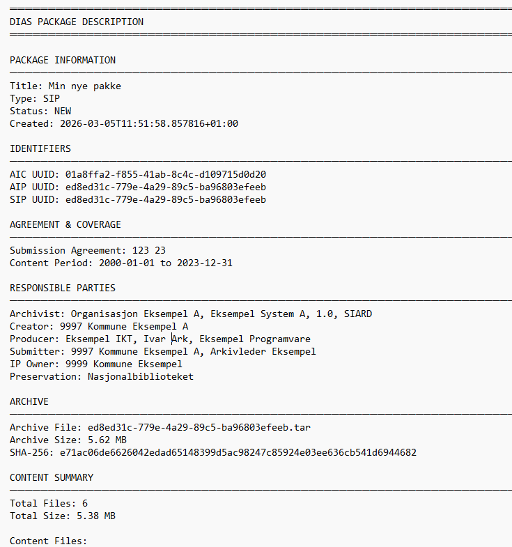

# Brukerveiledning (USER_GUIDE.md)

Dette dokumentet gir en trinnvis veiledning for bruk av DIAS Package Creator, inkludert skjermbilder og vanlige feilsituasjoner.

## 1. Hovedvindu
Applikasjonen består av tre hovedmenyer:
1. **File:** For utveksling av pakkedata med andre systemer.
2. **Tools:** For å validere og inspisere eksisterende pakker.
3. **Help:** For å se info om gjeldende versjon.

## 2. Faner og opprettelse av pakke

### 2.1. Opprett en ny pakke
#### 2.1.1 Velg stier
1. Gå til fanen **Source & Destination**.
2. Velg kilde mappen **Source Selection** som inneholder fil eller mappe som skal pakkes.
3. Velg mål mappen **Destination Selection** der den ferdige pakken skal lagres.
4. Fyll inn pakkenavn.

#### 2.1.2 Fyll inn metadata til METS
1. Gå til fanen **Package Metadata**.
2. Fyll inn aktuelle metadata til METS. Denne jobben blir lettere, men en utfylt dias_config.yml-fil

#### 2.1.2 Fyll inn metadata til PREMIS
1. Gå til fanen **Preservation (PREMIS)**.
2. Her kan det legges inn data for som gjøres tilgjengelig i logger som følger Premis. **Sjekk med langringssystem hvorvidt dette er støttet**.

#### 2.1.2 Opprett pakke
5. Klikk på **Create Package**.
6. Vent til prosessen er fullført - Sjekk at du får bekreftelse på at alt er ok, og last eventuelt ned kvittering. Kvittering ligger i rota på den nye pakken som er opprettet.

### 2.2. Valider en eksisterende pakke
1. Gå til menyen **Tools → Validate Package**.
2. Velg pakken som skal valideres.
3. Resultatet av valideringen vil vises i vinduet.

### 2.3. Beskriv en eksisterende pakke
1. Gå til menyen **Tools → Describe Package**.
2. Velg pakken som skal beskrives.
3. Resultatet av metadata vil vises i vinduet.

## 3. Vanlige Feilsituasjoner og Løsninger
- **Feil: "Ugyldig input-mappe"**
  - *Årsak:* Den valgte mappen finnes ikke eller mangler nødvendige filer.
  - *Løsning:* Kontroller at mappen eksisterer og inneholder riktig dataformat.
- **Feil: "Validering feilet: Manglende metadata"**
  - *Årsak:* Pakken mangler påkrevde metadata-felt i henhold til DIAS-standarden.
  - *Løsning:* Sjekk valideringsrapporten for detaljer om hvilke felt som mangler, og oppdater input-dataene.
- **Feil: "Kunne ikke skrive til output-mappe"**
  - *Årsak:* Manglende skriverettigheter til den valgte mappen.
  - *Løsning:* Velg en annen mappe eller kontakt systemadministrator for å få riktige rettigheter.

## 4. FAQ (Ofte Stilte Spørsmål)
- **Spørsmål:** Hvor finner jeg loggfilene?
  - *Svar:* Den enkleste måten er via menyen **Tools → Open Log Folder...**. Dette åpner riktig mappe direkte i filutforskeren.  
    Loggfilene lagres automatisk på plattform-spesifikke steder:
    - **Windows:** `%APPDATA%\dias_package_creator\logs`  
      (typisk: `C:\Users\<brukernavn>\AppData\Roaming\dias_package_creator\logs`)
    - **macOS:** `~/Library/Logs/dias_package_creator`
    - **Linux:** `~/.dias_package_creator/logs`  
    Filnavnene har formatet `dias_package_creator_YYYYMMDD_HHMMSS.log`. Applikasjonen beholder de 50 nyeste filene og sletter filer eldre enn 30 dager.
- **Spørsmål:** Hvordan oppdaterer jeg applikasjonen?
  - *Svar:* Se `INSTALL.md` for instruksjoner om oppgradering.
